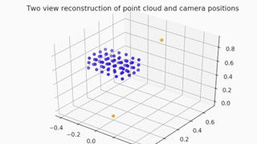

# MultipleViewGeometry
This code contains implementations of several Multiple View Geometry algorithms from Hartley and Zisserman, including the Sparse Levenberg-Marquardt algorithm for bundle adjustment. (See the notes sparseLM_bundleAdjustment.pdf for an explanation of this algorithm.)

